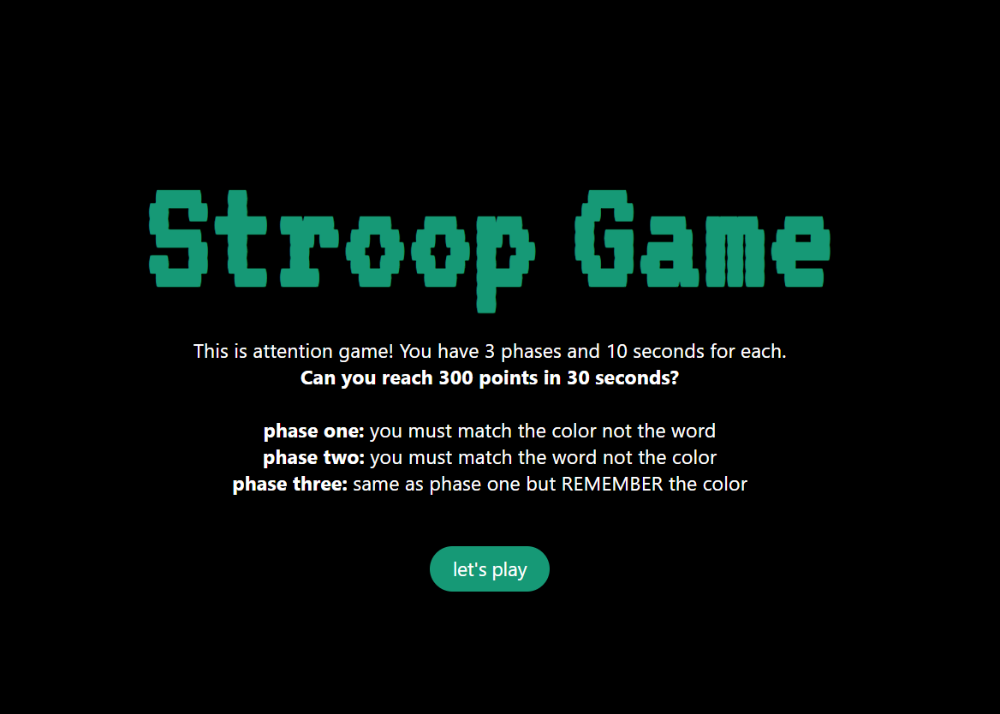

#Stroop Game
## Table of Contents
[Introduction](#introduction)
[Project Requirements](#project-requirements)
[Project Brief](#project-brief)
[Technologies](#technologies)
[Game Guide](#game-guide)
[Features](#features)
[Future Features](#future-features)

## Introduction
I was tasked to build a game for project 1 of the Software Engineering course at General Assembly. The Stroop Game is a web-based attention and memory challenge inspired by the psychological phenomenon known as Stroop Effect that occurs when the brain interprets conflicting information, like reading a color name printed in a different color. It causes a delay in reaction time

## Project Requirements
- Includes win/loss logic with appropriate messages
- Includes separate HTML, CSS, and JavaScript files
- Provides users with clear instructions on how to play the game
- User-friendly design
- Deployed online

## Project Brief
The project is built using front-end web technologies: HTML, CSS, and JavaScript,  with a focus on DOM manipulation, timed interactions, and responsive user feedback, Each phase introduces a new twist, to increase player attention

## Technologies

## Game Guide
**The game consists of 30 rounds, divided into 3 phases:**

**1. Phase 1 (Rounds 1–10):** Color of the Word
A color name (e.g. Green) displayed in a different font color (like red)
The task: click the button matching the font color, not the text

**2. Phase 2 (Rounds 11–20):** The Word Itself
Here the game rule reverses! 
The task: click the button that matches the word itself, ignoring the font color

**3. Phase 3 (Rounds 21–30):** Memory Challenge
A color name is shown briefly for seconds then disappears
The task: click the correct color from memory

**Time & Scoring**
- Each phase allows 10 seconds for a response, 1 second for each round in the phase
- Correct answers earn +10 points, wrong answers earn 0
- Maximum score is 300 points
- Final feedback message is shown based on the score

## Features
- Sound effects for correct and incorrect answers
- Timers and countdowns per round 
- Random button positioning each round to prevent pattern memorization
- Responsive and visually clear UI using CSS Flexbox

## Future Features
- Add difficulty levels or an adjustable timer
- Add localStorage for high score tracking
- Animations for transitions and feedback